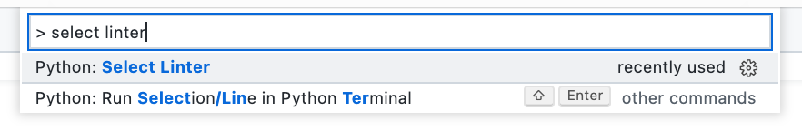

# Conventions for formatting code

Code is read more than it is written.

You have to re-read your code.

**Other** people have to read your code.

**Reading poorly-formatted code is a nightmare!** 😱

# PEP-8

Fortunately, most (if not all) programming languages come with style guides that specify how well-formatted code looks like.

Python has many different style guides. For example, Google has a style guide for Python code written within the company.

For the general community, Python specifies [PEP-8: Python Enhancement Proposal 8](https://www.python.org/dev/peps/pep-0008/).

PEP-8 tells us how to format variable names, constant names, where to put spaces (whitespace), maximum line length, etc.

## Naming conventions

The table below outlines some of the common naming styles in Python code and when you should use them:

| Type | Naming Convention | Examples |
| :-- | :-- | :-- |
| Function | Use a lowercase word or words. Separate words by underscores to improve readability | ``function``, ``my_function`` |
| Variable | Use a lowercase single letter, word, or words. Separate words with underscores to improve readability | ``x``, ``var``, ``my_variable`` |
| Constant | Use an uppercase single letter, word, or words. Separate words with underscores to improve readability | ``CONSTANT``, ``MY_CONSTANT``, ``MY_LONG_CONSTANT`` |

## Formatting

### Spacing and indentation

- Each identation should be four spaces
  - Pressing tab in Visual Studio Code is equivalent to pressing space bar four times
- Put spaces between math operators or conditions (i.e. ``5 == x``, not ``5==x``), **except**:
  - when operations are in an if statement with multiple conditions, or
  - when operations occur within brackets
    - ``if (5>=x) and (x/2!=1.0):``
- Put spaces around ``=`` signs
- Separate items in a list or function call with a comma and space: ``, ``
  - Don't put a space *before* the comma
- Surround functions with two blank lines above and below

### Line lengths

- The maximum number of characters on a line of code is 79
- The maximum length of a comment should be 72 characters
  - If your comment runs longer, split it across on multiple lines

# Task 1

> **Filename**: pep81.py

## Requirements

1. Set up automatic PEP-8 checking in Visual Studio Code
   1. Click on the View menu → Show Command Palette
   2. Type "select linter"
   3. Click on Python: Select Linter
      - 
   4. Click on **pycodestyle**
2. From now on, every time you save your work, you will see warnings about PEP-8 errors in Visual Studio Code.
3. Copy and paste the following code into ``pep81.py``, and fix the PEP-8 errors.

```python
##
# pep_8.py
# Created by: Matua Doc
# Use PEP-8 to clean up the code formatting

import random

# actors.


actors = ["Reed", "Henderson", "Davis", "McCormick", "Plumb", "Olsen", "Williams", "Knight", "Lookinland"]
movies = ["The Story of Mike", "Cousin Oliver", "Tiger 2: Revenge of Mr Phillips"]

# print out the name of the movies.
for movie in movies:
    print(movie+ " stars: ")

    # Pick a random set of actors, print their names.
    start_index = random.randint(0,5)
    endIndex = random.randint(start_index, len(actors))

     for i in range(start_index, endIndex):
        print("    - "+ str(actors[i]))
```

# Task 2

> **Filename**: password_pep8.py

## Requirements

1. Copy and paste your password checker code into ``password_pep8.py``
2. Fix any PEP-8 errors.

	
		
