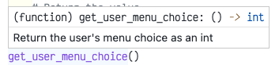

# Returning values from a function

Instead of making all the variables you want to modify into globals, it's sometimes more useful to **return** a value instead.

When a function returns a value, that value can be assigned to a variable or provide a value to be used in another function. Think of a returning function as a sort of variable.

For example, if we have a function that returns a string, that returning function can be used in place of an actual string:

```python
from random import randint

def random_duck_name() -> str:
    DUCKS = ["Hubert", "Dewford", "Llewellyn", "Webbigail", "Violet", "Lena"]
    index = randint(0, len(DUCKS) - 1)
    return DUCKS[index]

# Calling the function returns the value
# so we can print it
print(random_duck_name())
```

# How to return a value

1. specify the type of data that will be returned
    - add ``-> type`` after the function name. For example, ``-> int`` or ``-> str``
2. within the function, add the ``return`` keyword followed by the value to return. For example, to change the ``get_user_menu_choice()`` function to return the value rather than modify the ``choice`` variable:

```python
def get_user_menu_choice() -> int:
    print("Choose an option:")
    print("(1): Add an item")
    print("(2): Delete an item")
    print("(3): List all items")

    # Create a new value.
    new_choice = -1
    while new_choice == -1:
        try:
            new_choice = int(input("Type a number: "))
        except ValueError:
            print("Invalid number. Try again")

    # Return the value.
    return new_choice

choice = get_user_menu_choice() # Returns an int
if get_user_choice() == 1:
    # etc.
```

# Choosing a return type

New to recent versions of Python, you can specify what type of data a function will return. This will make it clear to you whether or not a function provides an integer, floating-point number, string, Boolean value, etc.

When you specify a return type, you should use one of the following values:

| Type | Description |
| :-- | :-- |
| ``int`` | integer (whole number) |
| ``float`` | floating-point number (decimal) |
| ``str`` | string |
| ``bool`` | Boolean value (``True``/``False``) |
| ``list`` | list of any type |
| ``dict`` | dictionary of any type |

> Functions that don't return anything *technically* return ``None``. You don't need to write this in your code.

# Documenting the return type

It is also good practice to document what type of data a function returns. This makes it available to programmers who browse your code's documentation.

If your function returns a value, modify the docstring to state what it **returns** and in what type.

| Before | After |
| :-- | :-- |
| Sets the user's menu choice | **Returns** the user's menu choice as an int |

This information becomes available when a user hovers over a function in Visual Studio Code.



