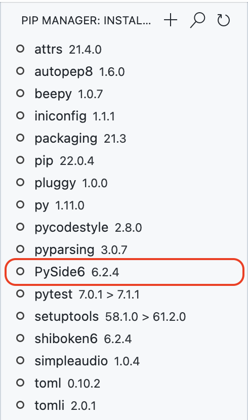
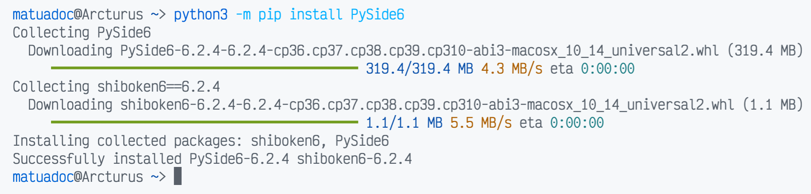
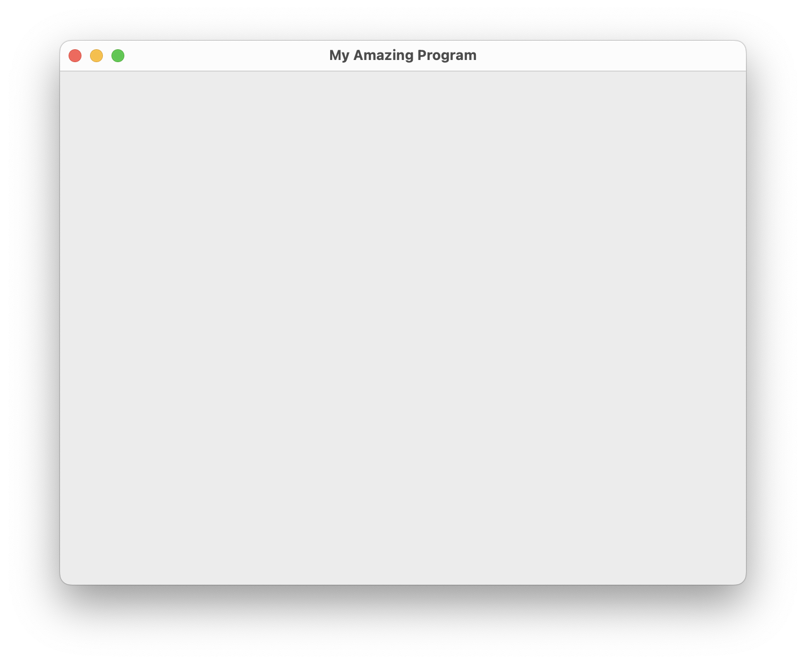
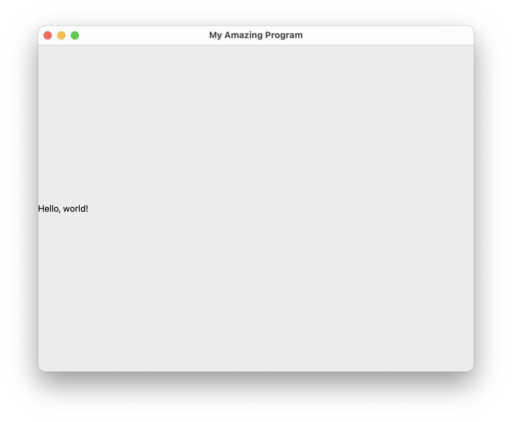
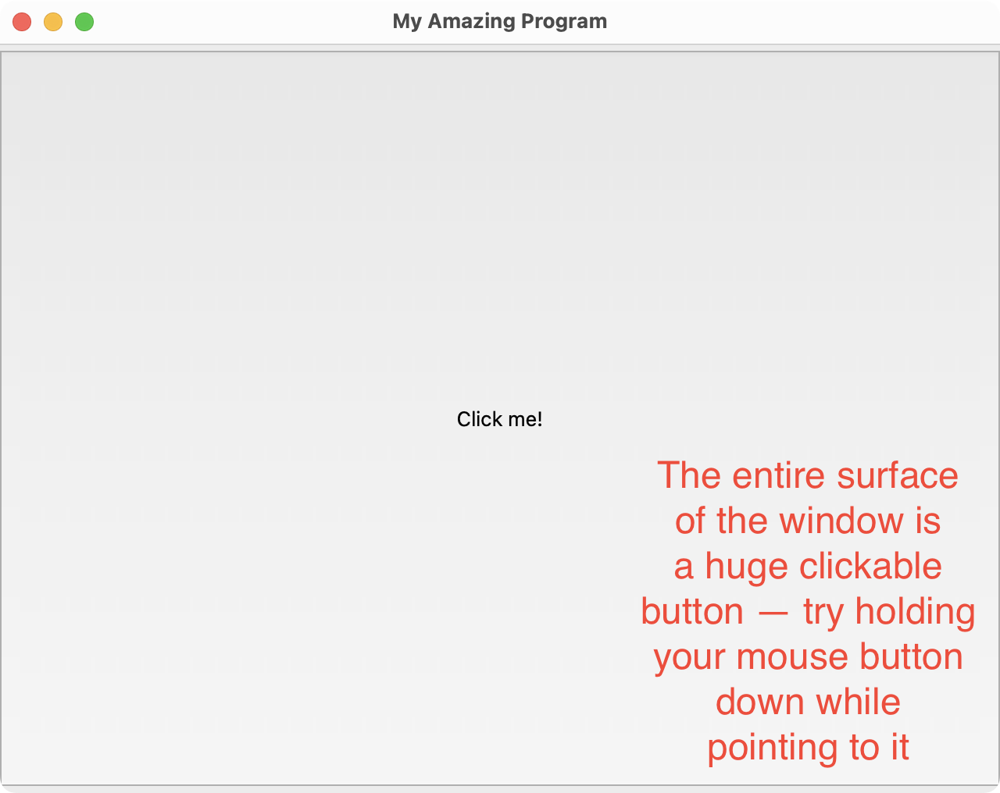
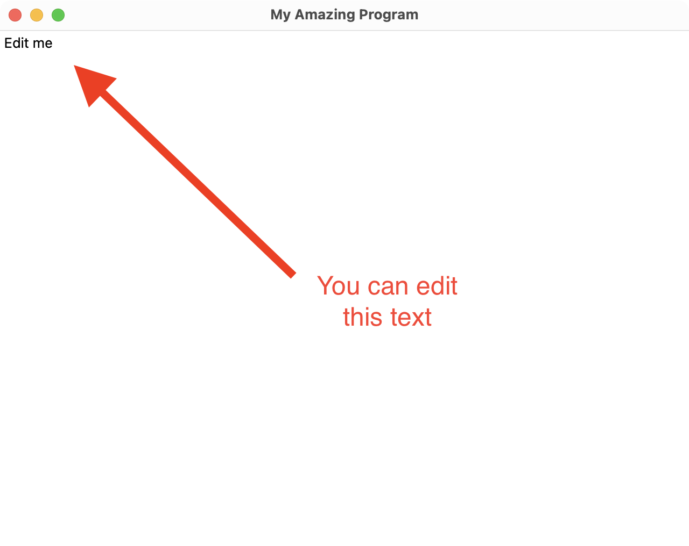
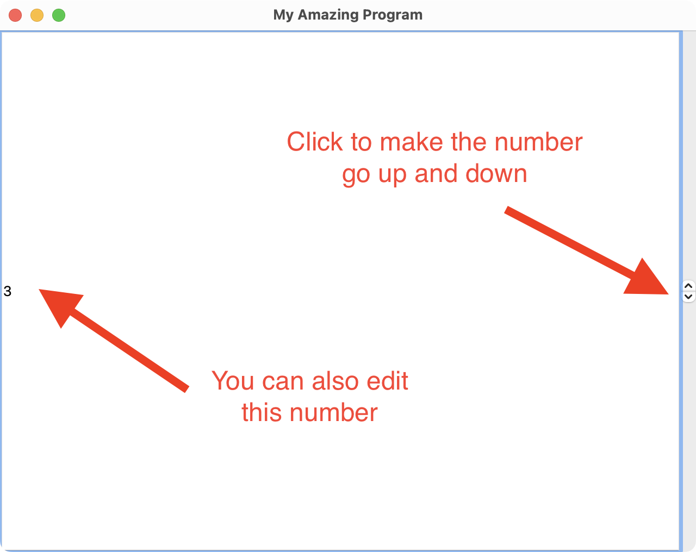
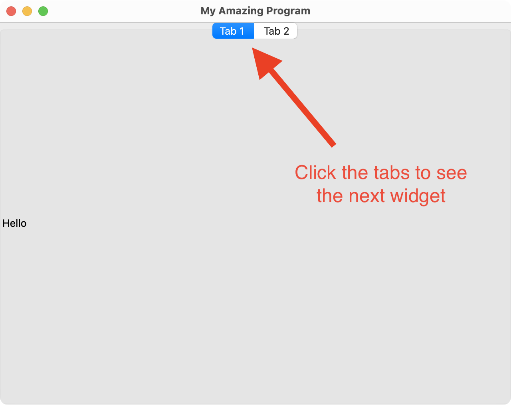

# Graphical user interfaces

At level 3, one of the complex programming techniques you can use is creating a Graphical User Interface (GUI). A GUI allows a program's user to interact with a program with windows, buttons, check boxes, radio buttons, etc.

This also increases the complexity of the program. It's no longer possible to simply print text — you have to manage an interface and update it appropriately in response to user input.

However, things don't have to be scary up front!

Let's start with a basic program that shows a window containing a label.

## Choosing a GUI toolkit

To create a GUI, you need to use a GUI toolkit. This is a library that creates the windows, labels, buttons, etc.

There are many toolkits available, some specific to a certain operating system. For example:

| Windows | macOS | Linux |
| :-- | :-- | :-- |
| Win32 | AppKit | GTK+ |
| Windows Forms | UIKit for Mac | Qt |
| WPF | SwiftUI |
| WinUI |

Some toolkits are available for multiple platforms:

- GTK+
- Qt
- wxWidgets
- tkinter

## Qt

In our class, we will use [**Qt**](https://www.qt.io). This is because Qt can be used on Windows, macOS, and Linux.

Many popular programs are written in Qt, including:

- [Autodesk Maya](https://www.autodesk.com/products/maya/overview)
- [Google Earth](https://www.google.com/earth/versions/)
- [KDE](https://kde.org/)
- [Malwarebytes](https://www.malwarebytes.com/)
- [Musescore](https://musescore.org/)
- [OBS Studio](https://obsproject.com/)
- [VirtualBox](https://www.virtualbox.org/)

Feel free to use a different toolkit if you like. However, you will be responsible for learning how to use it — you may find useful tutorials online. Please consult with your teacher if you plan to use a different toolkit.

# Install Qt support for Python

Follow these steps to install the Qt toolkit and the necessary packages to use Qt in Python:

- [using Pip Manager](#using-pip-manager)
- [using the Terminal](#manually-using-the-terminal)

## Using Pip Manager

Note: this method might take a long time, especially at school. This is suitable for at home.

1. Open Visual Studio Code
2. Click on the Pip Manager tab
3. Click Add Python Package at the top
4. Type ``PySide6`` in the command palette that appears, and press Enter/Return
5. Wait until you see PySide6 in the list of packages



## Manually, using the Terminal

If the Pip Manager method takes too long, try this:

1. Open Visual Studio Code
2. Create a new Python file and run the following code

    - ```python
      import sys
      print(f'"{sys.executable}" -m pip install PySide6')
      ```
3. You should see a result such as this: ``"C:\Program Files\Python310\python.exe" -m pip install PySide6``. Copy this command, including the quotation marks.
    - **Don't copy this example! RUN THE SCRIPT IN STEP 2!**
4. Click on the Terminal menu (at the top of the window or screen)
5. Click on New Terminal. At the bottom of the screen, a Terminal window will open
6. **On Windows only**: type ``cmd`` then press Enter
7. Paste the command you got from step 2, then press Enter



If you have any issues, contact Matua Doc on Teams.

## Import the PySide6 package

To create an interface with Qt, you will need to import the ``PySide6`` package. As part of this, you should also import the ``sys`` package.

> **Filename**: main.py

```python
from PySide6 import QtWidgets
import sys
```

## Create a Qt application

The first thing you need in a Qt program is to create a ``QApplication`` object. This tells Python that the program should create a graphical user interface using Qt.

```python
app = QtWidgets.QApplication()
```

## Create a Qt window

Next, you will create a window, give it a title, and set its size. The window will act as a canvas upon which we can add other interface elements, such as labels, buttons, text boxes, etc.

The following code:

1. creates a ``QMainWindow`` object
2. sets the window title (visible in the title bar)
3. resizes the window to a standard size
4. makes the window visible on screen

```python
# Create a QMainWindow object
main_window = QtWidgets.QMainWindow()

# Set the title at the top of the window
main_window.setWindowTitle("My Amazing Program")

# Set the size of the window
main_window.resize(640, 480)

# Display the window
main_window.show()
```



## Add a label widget to the window

To display elements in the window, you need to create more objects. Each object corresponds to a **widget** — the element or control that you want to show or with which a user will interact.

For our purposes, we will create a ``QLabel`` with some text.

```python
# Create a QLabel object
label = QtWidgets.QLabel("Hello, world")

# Add the QLabel widget to the main window
main_window.setCentralWidget(label)
```



## Run the QApplication

Finally, you need to run the ``QApplication`` to make any of the Qt code work.

```python
app.exec()
```

# Task

Instead of a GitHub assignment, you should play around with PySide to get to know its capabilities.

Create a new Python file and copy down the following code:

```python
import sys
from PySide6 import QtWidgets

app = QtWidgets.QApplication()

# Create the main window
main_window = QtWidgets.QMainWindow()
main_window.setWindowTitle("My Amazing Program")
main_window.resize(640, 480)
main_window.show()

# Add the widget
label = QtWidgets.QLabel("Hello, world!")
main_window.setCentralWidget(label)

app.exec()
```

1. Look through the [QtWidgets documentation](https://doc.qt.io/qtforpython/PySide6/QtWidgets/index.html#module-PySide6.QtWidgets) and see what other kinds of widgets you can add
2. Replace the ``QLabel`` with the following kinds of widgets:
   1. Button (``QPushButton``)
   2. Text field (``QTextEdit``)
   3. Spin box (``QSpinBox``)
   4. Tab widget (``QTabWidget``)
      - You can add multiple tabs with the instance method ``addTab(widget, title)``, where:
        - ``widget`` is a widget that should show in that tab
        - ``title`` is the name of the tab
        - ```python
          tab_widget = QtWidgets.QTabWidget()
          tab_widget.addTab(QtWidgets.QLabel("Hello"), "Tab 1")
          tab_widget.addTab(QtWidgets.QLabel("World"), "Tab 2")
          ```
3. Take screenshots of each of these. See if they match what I have:




